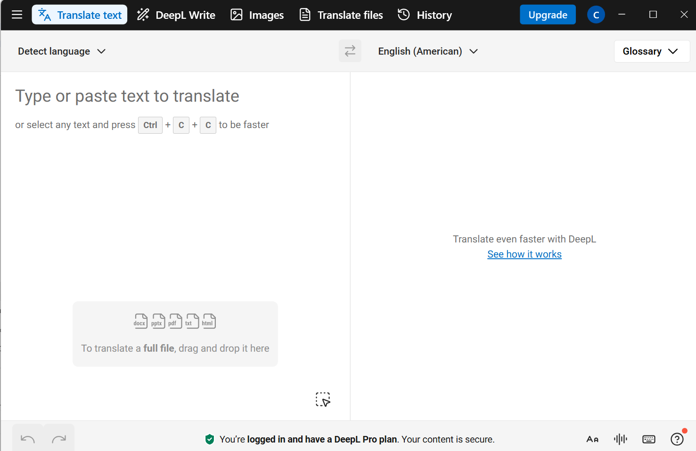

# ⚡ Quick Start: DeepL (Web)

Translate text or files in minutes.

## Step 1 — Open DeepL

Go to **DeepL** and sign in (if you have a Pro account).

<figure markdown>
  { width="900" }
  <figcaption>Start by typing text or click <b>Translate files</b> to upload a document.</figcaption>
</figure>

## Step 2 — Translate text

1. Paste or type your text on the **left**.
2. Choose the **target language** on the right.
3. Copy or download the result.

!!! tip
    For consistent terms, use a **Glossary**. See [How to use glossaries](how-to-use-glossaries.md).

## Step 3 — Translate a file

1. Click **Translate files** on the home screen.
2. Choose your **target language**.
3. Select your document (e.g., `.docx`, `.pptx`, `.pdf`).
4. Download the translated file.

## Result
You’ve translated text or documents.  
Next, add a glossary to control terminology.

**See also:**  
- [How to use glossaries](how-to-use-glossaries.md)  
- [Glossary limits](glossary-limits.md)
