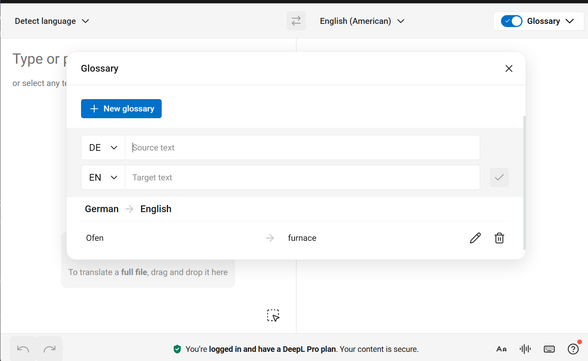
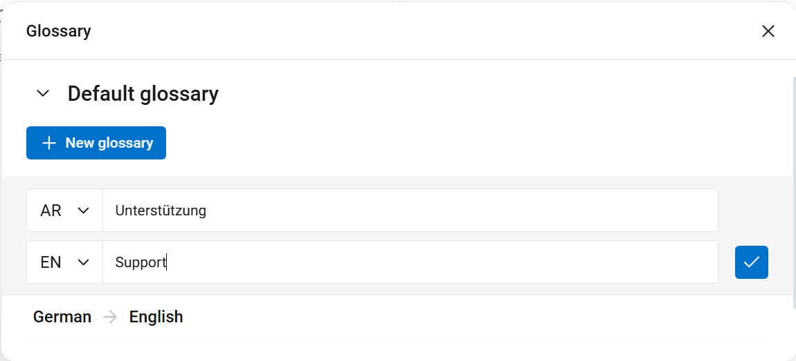

# DeepL — Create and Manage Glossaries

DeepL glossaries let you create a list of terms that should always be translated in a certain way. This is useful if you want product names, UI labels, or special terminology to stay consistent.

---

## Prerequisites

- A DeepL account (Free or Pro)  
- A web browser  
- (Optional) A DeepL **API key** if you want to try the advanced automation example

---

## Step 1 — Create a Glossary

1. Log in to **DeepL**.  
2. In the left panel, click **Glossaries**.  
3. Click **New glossary**.  
4. Give your glossary a name and choose the language pair (e.g., English → German).  
5. Click **Create**.

<figure>
  
  <figcaption>Create a new glossary from DeepL's Glossary panel.</figcaption>
</figure>

!!! tip
    Use a clear name such as `ProjectName_UI_en-de` so you can easily find it later.

---

## Step 2 — Add Entries

You can add terms in two ways:

- **Manually** (best for a few terms)  
- **Using a file** (best for many terms at once)

=== "Add Manually"
    1. Click **Add entry**.  
    2. Type the **Source term** (the word you want to translate) and the **Target term** (the translation).  
    3. (Optional) Add a **Comment** for notes.  
    4. Click **Save**.

    !!! tip
        Choose this option if you only have a handful of terms.

=== "Upload from a File"
    DeepL also allows you to copy and paste a list of terms from a **CSV file**.

    > **What is a CSV file?**  
    A CSV is a very simple table stored as text, where each line contains values separated by commas.  
    You can create one in Excel or Google Sheets and **export it as CSV**.

    **CSV format example:**
    ```text
    source_term,target_term,comment
    file,Datei,UI label
    folder,Ordner,UI label
    translate,übersetzen,verb form
    ```

    !!! tip
        If you already manage terminology in a spreadsheet, export it as CSV and paste the lines into DeepL’s import box.

<figure>
  
  <figcaption>Bulk entry via CSV paste is useful when you have dozens of terms.</figcaption>
</figure>

---

## Step 3 — Use the Glossary in Translation

1. Start a new translation in DeepL as usual.  
2. Above the translation box, choose your **Glossary** from the dropdown for the current language pair.  
3. DeepL will automatically apply your preferred terms.

> If a term doesn’t change as expected, check the spelling, capitalization, or plural form.

---

## Step 4 — Export or Import Glossaries

You can back up or reuse your glossaries.

| Action   | How to do it                               | Result                          |
|----------|--------------------------------------------|---------------------------------|
| **Export** | Glossary → ••• → **Export CSV**            | Downloads all entries as CSV    |
| **Import** | Glossary → **Add entries** → Paste CSV     | Adds entries from another file  |

Footnote: Glossary behavior may vary slightly across languages[^1].

[^1]: DeepL occasionally updates glossary handling for specific language pairs.

---

## Troubleshooting

??? info "I don’t see my glossary"
    - Make sure you selected the correct **language pair**.  
    - Refresh the page if you just created the glossary.

??? failure "My CSV import failed"
    - Check that each line has exactly three columns: `source_term, target_term, comment`.  
    - Remove any semicolons, tabs, or stray spaces.

---

## (Optional) Step 5 — Automation with the DeepL API

If you have a DeepL API key, you can create glossaries programmatically.

=== "macOS / Linux (bash)"
    ```bash
    curl https://api-free.deepl.com/v2/glossaries \
      -H "Authorization: DeepL-Auth-Key YOUR_API_KEY" \
      -d "name=ACME_UI_en-de" \
      -d "source_lang=EN" \
      -d "target_lang=DE" \
      --data-urlencode "entries=file,Datei\nfolder,Ordner\ntranslate,übersetzen"
    ```

=== "Windows PowerShell"
    ```powershell
    curl https://api-free.deepl.com/v2/glossaries `
      -H "Authorization: DeepL-Auth-Key YOUR_API_KEY" `
      -d "name=ACME_UI_en-de" `
      -d "source_lang=EN" `
      -d "target_lang=DE" `
      --data-urlencode "entries=file,Datei`nfolder,Ordner`ntranslate,übersetzen"
    ```

=== "Windows CMD"
    ```bat
    curl https://api-free.deepl.com/v2/glossaries ^
      -H "Authorization: DeepL-Auth-Key YOUR_API_KEY" ^
      -d "name=ACME_UI_en-de" ^
      -d "source_lang=EN" ^
      -d "target_lang=DE" ^
      --data-urlencode "entries=file,Datei!NL!folder,Ordner!NL!translate,übersetzen"
    ```
    > Note: CMD doesn’t have a native newline escape; you can paste lines directly, or replace `!NL!` with real newlines when running.

!!! note
    Make sure the code block ends with a line containing three backticks.  
    In Markdown, **opening and closing fences must match**, or the renderer will treat the rest of the page as code.
