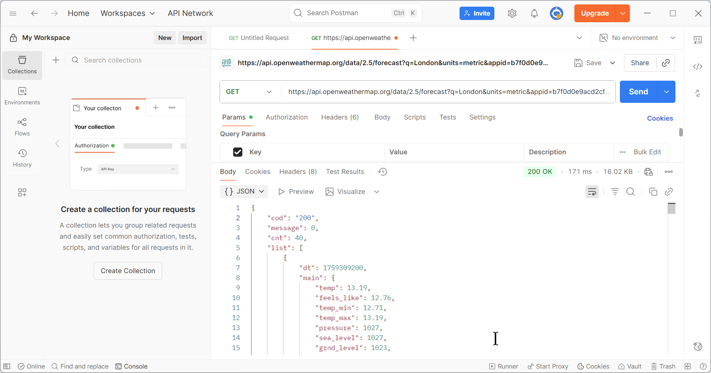

# 🌦 OpenWeather API — 5-Day Forecast

This guide explains how to use the **5-Day / 3-Hour Forecast API** endpoint.  
It returns forecasted weather data in 3-hour steps, up to 5 days ahead.  

---

## 🚀 Quickstart Example

**Request URL**

https://api.openweathermap.org/data/2.5/forecast?q=London&units=metric&appid=YOUR_API_KEY


Replace `YOUR_API_KEY` with your actual OpenWeather key.  

<figure markdown>
  { width="900" loading="lazy" }
  <figcaption>Figure: 5-day forecast request in Postman using the <code>/data/2.5/forecast</code> endpoint for London.</figcaption>
</figure>

---

## 📦 Example Response (trimmed JSON)

Below is a shortened response. The real response contains many forecast entries.

```json
{
  "cod": "200",
  "city": {
    "id": 2643743,
    "name": "London",
    "country": "GB",
    "timezone": 3600
  },
  "list": [
    {
      "dt": 1696180800,
      "main": {
        "temp": 17.3,
        "feels_like": 17.0,
        "pressure": 1013,
        "humidity": 65
      },
      "weather": [
        { "id": 803, "main": "Clouds", "description": "broken clouds", "icon": "04d" }
      ],
      "clouds": { "all": 60 },
      "wind": { "speed": 4.2, "deg": 90 },
      "dt_txt": "2025-10-01 12:00:00"
    },
    { "... more forecast entries ..." }
  ]
}
## 📖 Response Breakdown

| Field                         | Example Value           | Description                  |
|-------------------------------|-------------------------|------------------------------|
| `city.name`                   | `"London"`              | City name.                   |
| `city.country`                | `"GB"`                  | Country code.                |
| `list[].dt`                   | `1696180800`            | Forecast time (UNIX timestamp). |
| `list[].dt_txt`               | `"2025-10-01 12:00:00"` | Forecast time (readable string). |
| `list[].main.temp`            | `17.3`                  | Forecasted temperature.      |
| `list[].main.humidity`        | `65`                    | Forecasted humidity (%).     |
| `list[].main.pressure`        | `1013`                  | Forecasted pressure (hPa).   |
| `list[].weather[0].description` | `"broken clouds"`     | Weather description.         |
| `list[].clouds.all`           | `60`                    | Cloudiness (%).              |
| `list[].wind.speed`           | `4.2`                   | Wind speed.                  |
| `list[].wind.deg`             | `90`                    | Wind direction (degrees).    |

## 🛠 Query Parameters

| Parameter | Required | Example    | Description                                                   |
|-----------|----------|------------|---------------------------------------------------------------|
| `q`       | Yes      | `London`   | City name. Add country code if needed (e.g., `Paris,FR`).     |
| `appid`   | Yes      | `Your API key` | Authentication key.                                      |
| `units`   | No       | `metric`   | Units of measurement: `standard`, `metric`, or `imperial`.    |
| `lang`    | No       | `de`       | Response language (e.g., `fr`, `es`, `de`).                  |
| `cnt`     | No       | `10`       | Limit the number of forecast items returned.                  |

## 🛠 Troubleshooting

| Error Code | Meaning                 | How to Fix |
|------------|-------------------------|------------|
| **401 Unauthorized** | Invalid or inactive API key. | Verify your key is active, correctly copied, and has no extra spaces/newlines. |
| **404 City not found** | Wrong city name or missing country code. | Check spelling and use `q=City,CountryCode` (e.g., `Paris,FR`). |
| **429 Too Many Requests** | Exceeded plan request limit. | Wait before retrying or upgrade your plan. |

**Note:** Responses can be very large; use the `cnt` parameter to limit the number of forecast items returned.

---

## 📌 Next Steps

- Visualize the forecast data in a chart or dashboard.  
- Combine with the `/weather` endpoint for **current + future conditions**.  
- Add query params like `lang=fr` or `units=imperial` to localize your output.  


