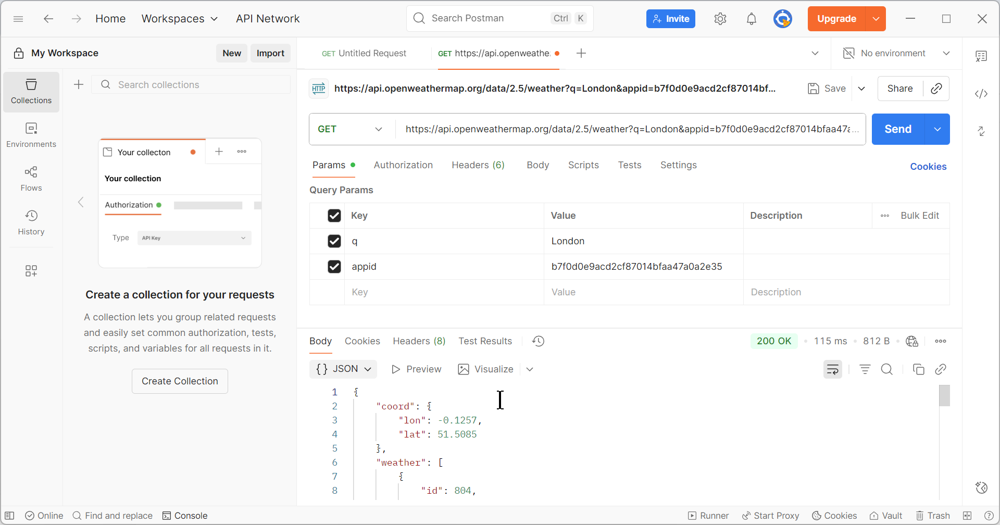

# 🌦 OpenWeather API — Getting Started

This guide shows how to make your first request to the OpenWeather API, view the JSON response, and understand the key fields. It is designed for beginners, with step-by-step instructions using **Postman**.

---

## 🚀 Quickstart with Postman

You can use [Postman](https://www.postman.com/downloads/) to test the API without writing code.

### 1. Install Postman
Download the free Postman desktop app.

### 2. Get Your API Key
1. Log in to your [OpenWeather account](https://home.openweathermap.org/).
2. Go to **My API Keys**.
3. Copy your **API key** (a long string of letters/numbers).  

⚠️ Note: Keys may take up to 2 hours to activate.

### 3. Make Your First Request
In Postman, create a new **GET** request:

<figure markdown>
{ width="900" loading="lazy" }

  <figcaption>Figure: Current weather request in Postman using the <code>/data/2.5/weather</code> endpoint for London.</figcaption>
</figure>