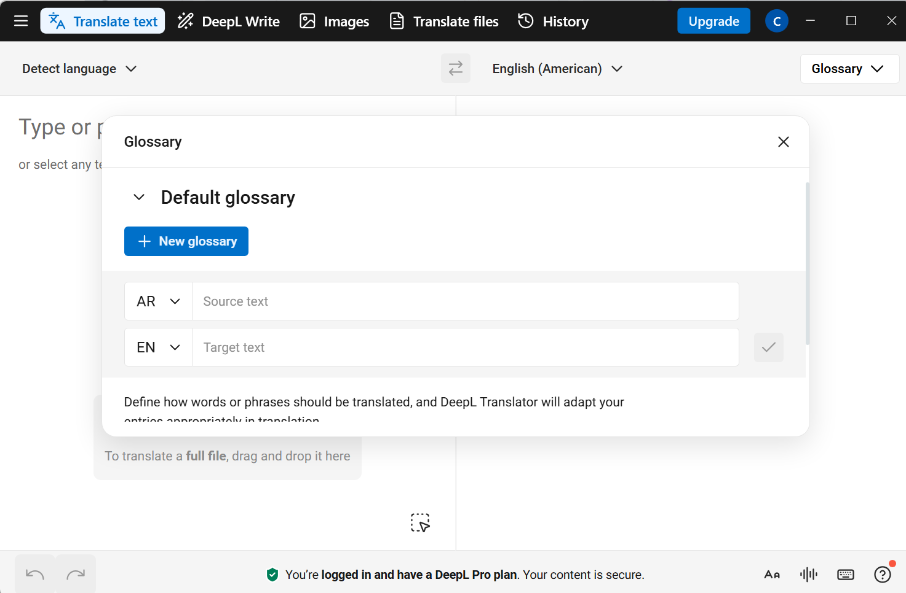

# 📘 How to Use Glossaries (DeepL Web)

Control terminology across your translations.

## What you need
- DeepL account (Free or Pro)
- Terms to enforce (e.g., product names)

## 1) Open the Glossary

1. In the DeepL interface, open **Glossary** (top bar).
2. Choose a language pair for the glossary.

<figure markdown>
  { width="900" }
  <figcaption><b>Glossary</b> — add terms and translations, then <b>Save</b>.</figcaption>
</figure>

## 2) Create or select a glossary

- Click **New glossary** (name it), or select an existing one.
- Keep one glossary per language pair for clarity.

## 3) Add entries

1. Enter **Term** (source) and **Translation** (target).
2. Click **Save** to add each pair.
3. Repeat for all key terms.

## 4) Apply the glossary

- Make sure the glossary is **selected/active** when translating.
- Type or paste text — terms should follow your glossary.
- For files, the glossary applies when it’s active at upload time.

<!-- Optional screenshot; uncomment when you add it:
<figure markdown>
  { width="900" }
  <figcaption><b>Apply glossary</b> — ensure the glossary is selected so terms are enforced.</figcaption>
</figure>
-->

## Result
Your translations follow your approved terminology.

**See also:**  
- [Quick Start](quick-start.md)  
- [Glossary limits](glossary-limits.md)
