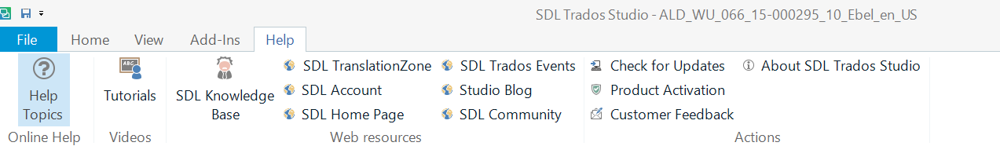
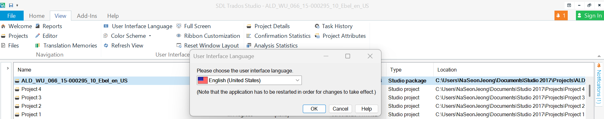

# 📘 How to Access Help in Trados Studio 2017

## Who this is for
Translators who want to quickly find support, tutorials, or solutions while working in **Trados Studio 2017**.

## What you need
- SDL Trados Studio 2017 installed  
- Internet connection (for online resources)

## Steps

1. **Open the Help ribbon**  
   - At the top of the Trados window, click the **Help** tab.  
   - This ribbon is available in all views.
   <figure markdown>
  { width="900" }
  <figcaption><b>Help</b> tab — links out to Knowledge Base, Community, and Support.</figcaption>
</figure>

2. **Choose a help option**  
   - **Studio Blog** → Articles and tips about using Trados.  
   - **Knowledge Base (KB)** → FAQs and troubleshooting guides.  
   - **SDL Community** → Online discussion forum with other users.  
   - **Customer Feedback** → Send feedback directly to SDL.  
   - **Contact Support** → Open the SDL TranslationZone support page.

3. **Download resources**  
   - From the SDL TranslationZone, go to **Learn & Support → Downloads**.  
   - There you’ll find guides, updates, and additional tools.
### Change the UI language {#ui-language}

If your Trados menus are not in English, switch the **User interface language**:

<figure markdown>
  { width="900" }
  <figcaption><b>View → User interface language</b> — select <b>English</b>, then restart Trados when prompted.</figcaption>
</figure>

## Result
You can now access official documentation, community forums, and SDL support directly from within Trados.

## If things go wrong
- **The Help ribbon doesn’t appear:** Make sure you are on the latest service pack for Trados Studio 2017.  
- **Links don’t open:** Check your internet connection or try opening them in a separate browser.  

---

*Last updated: 2 Sept 2025*
