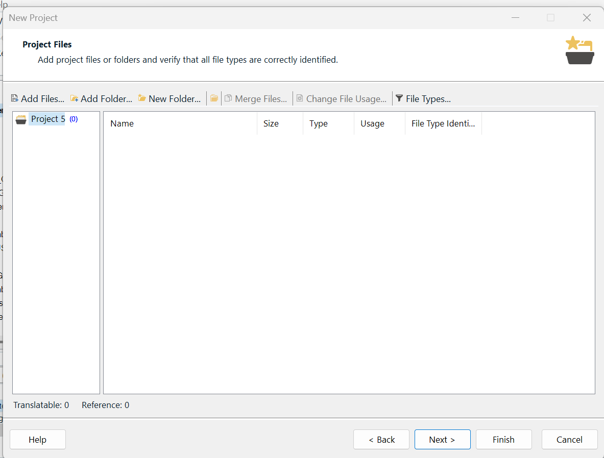

# 🧭 How-To: Create a Project

Set up a new Trados project using the wizard.

## Before you start
- Your **source files** are ready (e.g., `.docx`, `.txt`).
- You know your **source** and **target** language(s).
- (Optional) You have a **Translation Memory (TM)** to reuse — or you’ll create one.

## 1) Start the wizard

From the **Home** tab, click **New Project**.

<figure markdown>
  { width="900" }
  <figcaption><b>Home → New Project</b> — starts the setup wizard.</figcaption>
</figure>

## 2) Project Details

Name your project and choose where to save it.

<figure markdown>
  { width="900" }
  <figcaption><b>Project Details</b> — give the project a clear name and folder.</figcaption>
</figure>

## 3) Language Pairs

Pick the **source** and **target** language(s).

<figure markdown>
  { width="900" }
  <figcaption><b>Language Pairs</b> — set the languages you’ll translate between.</figcaption>
</figure>

## 4) Add Files

Add the documents you want to translate.

<figure markdown>
  { width="900" }
  <figcaption><b>Add Files</b> — select your source documents.</figcaption>
</figure>

## 5) Translation Memories

Attach an existing **TM** or **Create** a new one (recommended if you don’t have one).

<figure markdown>
  { width="900" }
  <figcaption><b>Translation Memories</b> — reuse previous translations or start a new TM.</figcaption>
</figure>

## 6) Finish

Review the summary and click **Finish**. Trados creates the project and opens it in the **Editor**.

<!-- Optional screenshot; uncomment when you have it
<figure markdown>
  { width="900" }
  <figcaption><b>Finish</b> — confirm settings and create the project.</figcaption>
</figure>
-->

## Result
Your project appears in **Home → Projects** and opens in the **Editor** ready to translate.

**See also:**  
- [⚡ Quick Start](quick-start.md) — the short version  
- [📘 How to Access Help](help-guide.md#ui-language) — switch the UI language if needed
