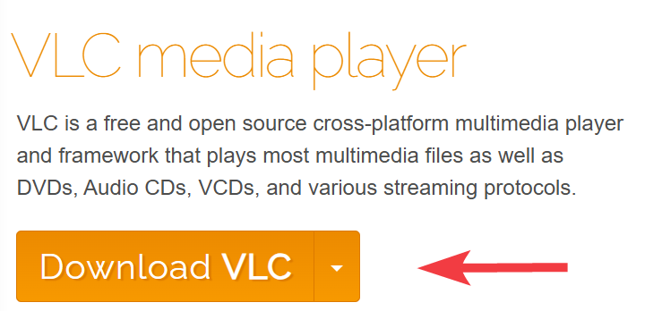

# Anleitung: Installation von VLC Media Player

## Einführung
Diese Anleitung erklärt, wie Sie den VLC Media Player auf einem Windows-Computer herunterladen und installieren.  
Sie richtet sich an Anfänger und alle, die einen einfachen und zuverlässigen Media Player nutzen möchten.

---

## Voraussetzungen
Bevor Sie beginnen, stellen Sie sicher, dass Sie Folgendes haben:
*   Einen Computer mit Windows 10 oder neuer  
*   Eine Internetverbindung, um das Installationsprogramm herunterzuladen  
*   Administratorrechte auf Ihrem Computer, um Software zu installieren  

---

## Schritt-für-Schritt-Anleitung

### 1. Installationsdatei herunterladen
Rufen Sie die offizielle VLC-Website unter `www.videolan.org` auf.  
Die Seite erkennt Ihr Betriebssystem automatisch. Klicken Sie auf den großen orangefarbenen Button **„Download VLC“**.

---

### 2. Installationsdatei ausführen
Suchen Sie die heruntergeladene Datei (normalerweise im Ordner `Downloads`, Dateiname z. B. `vlc-*-win64.exe`).  
Doppelklicken Sie auf die Datei, um sie zu starten.  
Wenn das Fenster „Benutzerkontensteuerung“ erscheint, klicken Sie auf **„Ja“**, um der App Änderungen am Gerät zu erlauben.

---

### 3. Installationsassistenten durchlaufen
Der Installationsassistent wird geöffnet. Die Standardeinstellungen sind in der Regel ausreichend.  
- Wählen Sie die gewünschte Sprache → **Weiter**  
- Lizenzvereinbarung prüfen → **Weiter**  
- Komponenten auswählen (Standard beibehalten) → **Installieren**  

---

### 4. Installation abschließen
Warten Sie, bis der Fortschrittsbalken voll ist.  
Aktivieren Sie die Option **„VLC ausführen“** und klicken Sie auf **„Fertigstellen“**, um das Programm zu starten.

---

## Tipps und häufige Probleme
*   Wenn das Installationsprogramm nicht startet: Rechtsklick → **„Als Administrator ausführen“**.  
*   Laden Sie VLC immer nur von der offiziellen Seite `videolan.org` herunter, um unerwünschte Software zu vermeiden.  

---

## Ergebnis
Nach Abschluss dieser Schritte können Sie den VLC Media Player öffnen und nahezu jedes Video- oder Audioformat auf Ihrem Computer abspielen.

---

**Autor:** Chafyn Hörnecke  
**Zuletzt aktualisiert:** 11.09.2025
