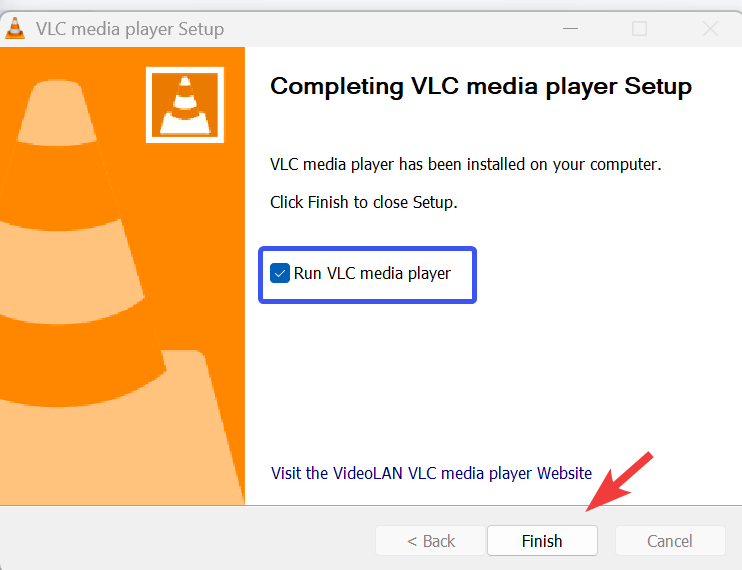

# Before & After Rewrite

This sample demonstrates how I can take poorly written documentation and transform it into clear, professional user instructions.  

---

## ⚠️ Original (as found)

# how to install vlc media player on your computer windows

VLC is a video player that can play almost anything so you probably want it. To install it you have to go to the internet and search for the download link, it is not hard but sometimes people do it wrong and then they get virus so be careful. First open your browser like chrome or internet explorer (or edge or whatever you have) and type VLC download free. Many websites show you links but you must pick the right one, but anyway usually the first or second link works fine. Click on it and then wait until it downloads, but if it doesn’t you can refresh the page. When it is finished it will be in your download folder but sometimes it goes somewhere else depending on your computer settings which you should check if you don’t see it. Double click it and if something pops up just click yes. The installer will open but it has a lot of options so just click next next next until it says finish.  

if it does not work then you might need to restart your pc or maybe you downloaded the wrong file (like for 32 bit instead of 64 bit but anyway most computers now are 64 bit so you can try both if it doesn’t work). Also some people complain that the sound doesn’t play after install, this is usually because their speakers are broken or muted so check that first before asking.  

Ok so now you should have vlc running, if you don’t maybe uninstall and repeat. good luck

---

## ✅ Rewritten (professional version)

# Installing VLC Media Player on Windows

This guide explains how to download and install **VLC Media Player** on a Windows computer. VLC is a free, reliable player that supports most audio and video formats.

---

### Prerequisites
- A computer running **Windows 10 or later**  
- An **internet connection** to download the installer  
- Administrator rights on your computer  

---

### Step 1 — Download the Installer
1. Go to the official VLC website: [www.videolan.org](https://www.videolan.org).  
2. The site detects your operating system automatically.  
3. Click the big orange button **“Download VLC.”**

!!! warning
    Only download VLC from the official website to avoid malware or unwanted software.

---

### Step 2 — Run the Installer
1. Locate the downloaded file (usually in your **Downloads** folder, named `vlc-*-win64.exe`).  
2. Double-click the file.  
3. If Windows asks for permission, click **Yes**.

---

### Step 3 — Complete the Installation
1. Follow the installation wizard:  
   - Choose your preferred language  
   - Accept the license agreement  
   - Leave the default components selected  
2. Click **Install**.  

---

### Step 4 — Finish and Launch
1. Wait for the installation to finish.  
2. Make sure the box **“Run VLC”** is checked.  
3. Click **Finish** to start VLC.

---

### Troubleshooting
- **Installer doesn’t start** → Right-click the file and choose **Run as administrator**.  
- **Downloaded the wrong version** → Re-download from videolan.org and select the 64-bit Windows installer.  
- **No sound in videos** → Check if your speakers are connected and not muted.  

---

## ✨ Result
With these steps, VLC Media Player will be installed and ready to play almost any audio or video file.

---

**Author:** Chafyn Hörnecke  
**Last updated:** 11.09.2025
