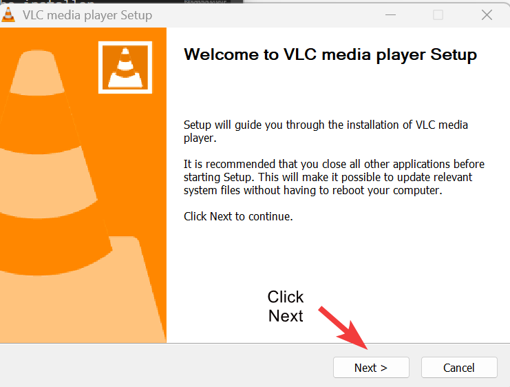

# Visual Sample — Annotated Screenshots

This sample demonstrates how annotated screenshots can make technical instructions faster and easier to follow.  
Visuals reduce confusion, especially for beginners who may not be familiar with software terminology.

---

## Example: Downloading VLC Media Player

### Step 1 — Go to the official website
{ width="80%" }

*The orange **Download VLC** button is highlighted to show the exact action.*

---

### Step 2 — Run the installer
{ width="80%" }

*The installer file `vlc-*-win64.exe` is circled so users can find it quickly.*

---

### Step 3 — Complete installation wizard
{ width="80%" }

*The **Next** button is highlighted so users know how to proceed through the wizard.*

---

### Step 4 — Finish and launch VLC
{ width="80%" }

*The checkbox **Run VLC** is shown selected, so VLC opens automatically after installation.*

---

## Why visuals matter
- Reduce cognitive load — users can confirm they are on the right screen.  
- Highlight the **exact control** or file to click.  
- Improve accessibility for non-native speakers.  
- Increase user confidence by matching their real interface.

---

## Tools used
- Screenshots captured in **Windows 10**  
- Annotations added with simple **highlighting and circles**  

---

**Author:** Chafyn Hörnecke  
**Last updated:** 11.09.2025
