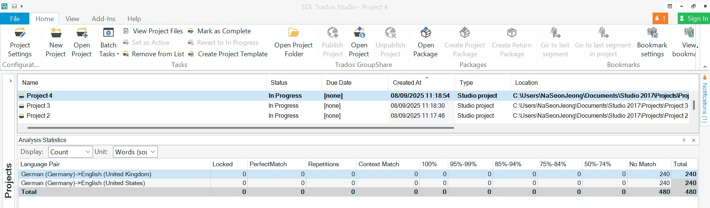
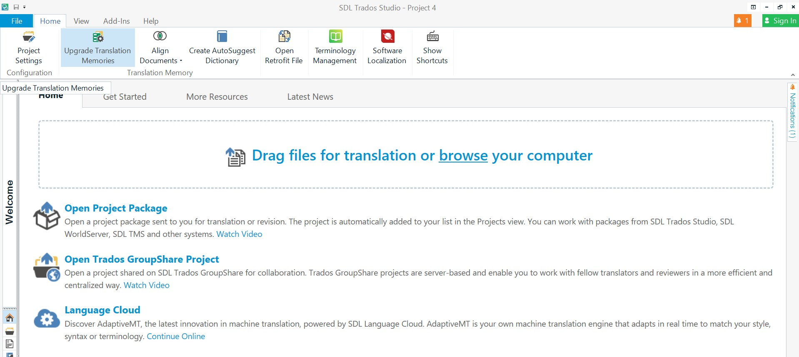
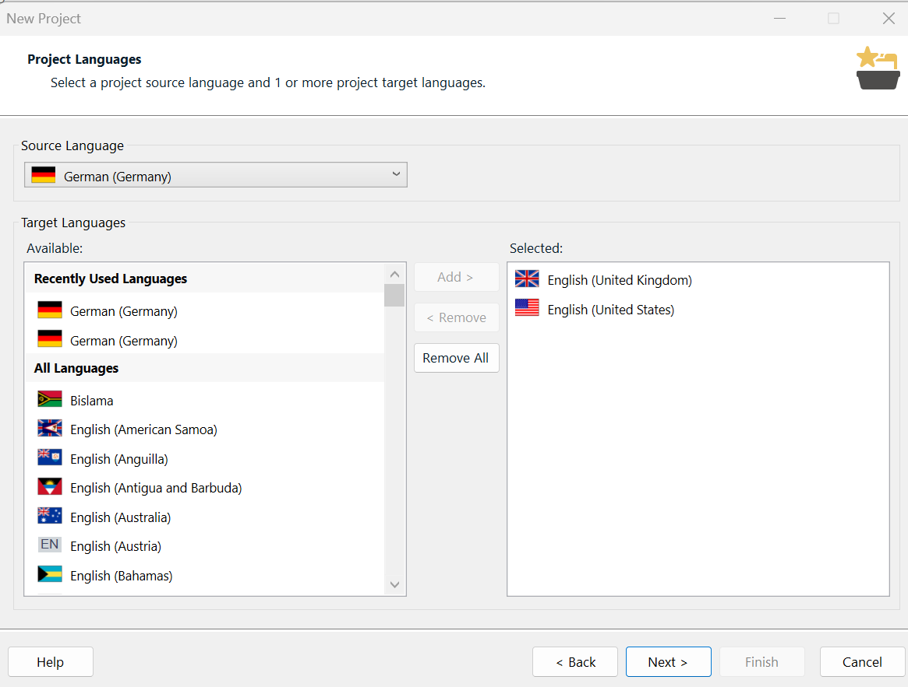
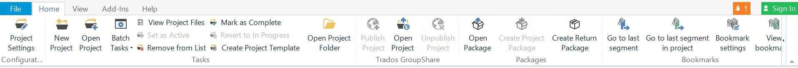
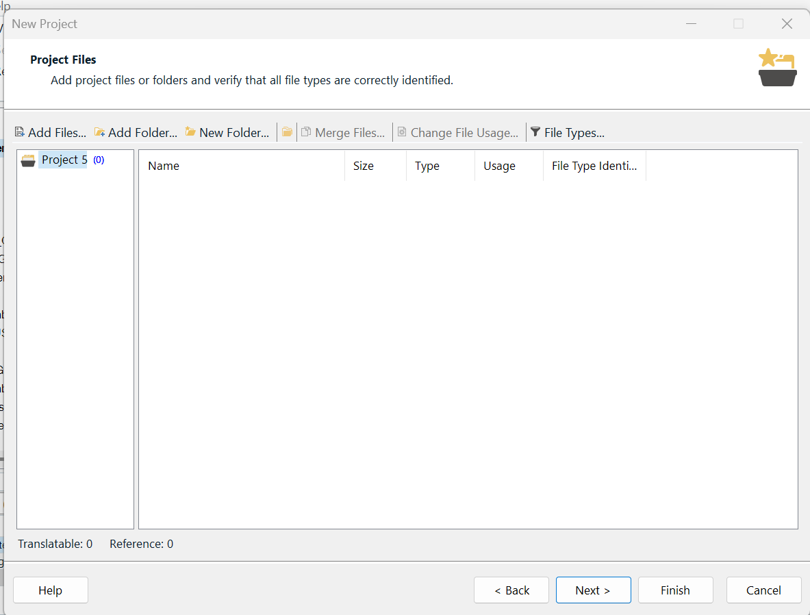

# ⚡ Quick Start: Trados Studio 2017

Set up your first project in a few minutes.

## Step 1 — Open Trados Studio

When Trados opens, you land on the **Home** tab in the **Projects** view.

<figure markdown>
  { width="900" }
  <figcaption><b>Home → Projects</b> view — the normal starting point.</figcaption>
</figure>

!!! note "Alternative: drag & drop files"
    On some setups you may see the **Get Started** area on the Home tab where you can drag files for translation. That’s an alternative entry point:

    <figure markdown>
      { width="900" }
      <figcaption>Use <b>Drag files for translation</b> or click <b>browse</b> to choose files.</figcaption>
    </figure>
If your menus aren’t in English, see [Change the UI language](help-guide.md#ui-language).

## Step 2 — Create your first project

1. Click **New Project** on the ribbon.
2. In **Project Details**, enter a **Project name** and **Location**.
3. Choose your **source language** and **target language(s)**.
4. Click **Add Files** and select your source documents (e.g., .docx, .txt).
5. Add a **translation memory (TM)** — choose an existing one or click **Create** to make a new TM.
6. Click **Finish** — Trados creates the project and opens it in the **Editor**.

### Screenshots (for Step 2)

<figure markdown>
  { width="900" }
  <figcaption><b>Wizard — Language Pairs</b>: set source and target languages.</figcaption>
</figure>

<figure markdown>
  { width="900" }
  <figcaption><b>Home → New Project</b>: click to start the wizard.</figcaption>
</figure>

<figure markdown>
  { width="900" }
  <figcaption><b>Wizard — Add Files</b>: select the files to translate.</figcaption>
</figure>

**Next:** See [How-To: Create a Project](how-to-create-project.md) for more detail.

---

*Last updated: 3 Sept 2025*
