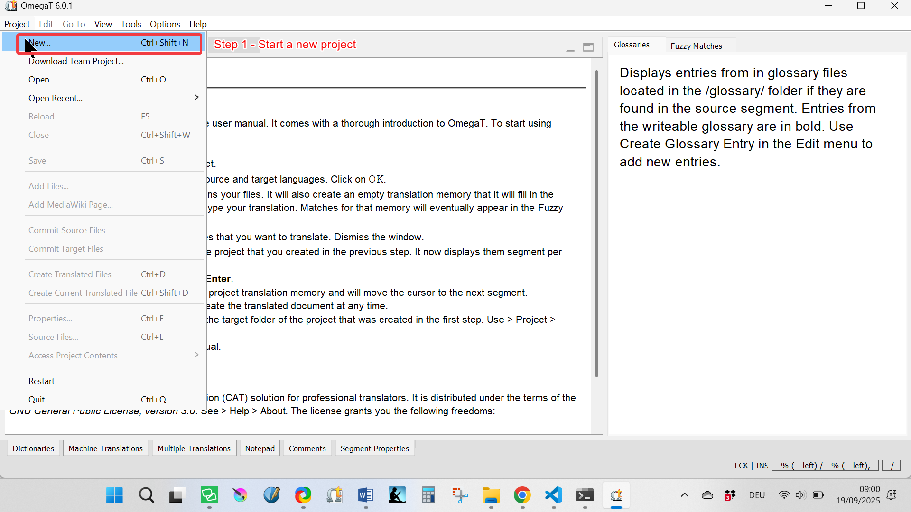
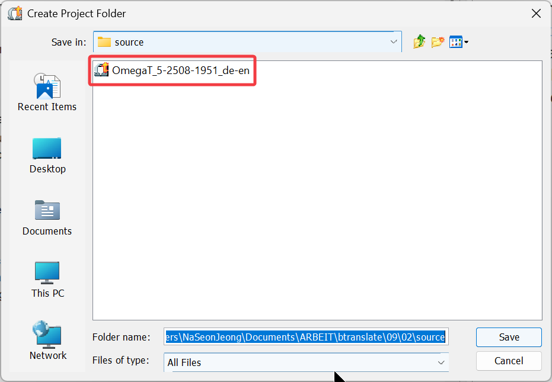
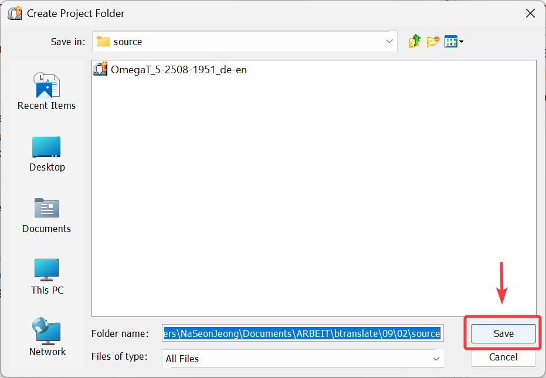
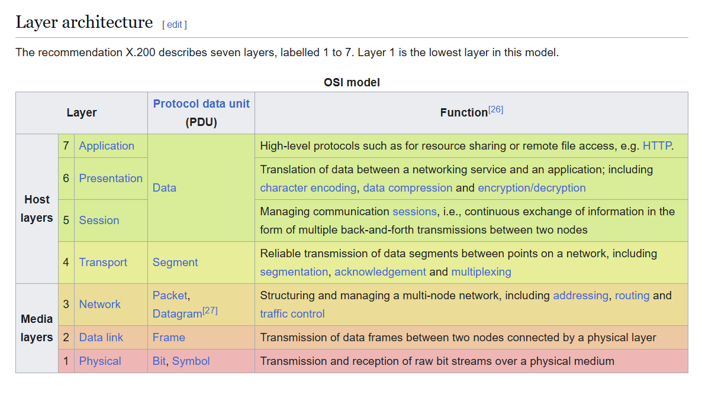
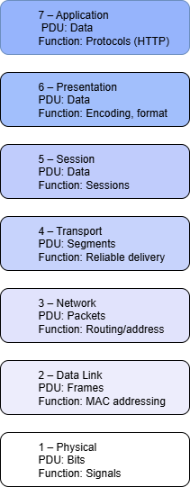
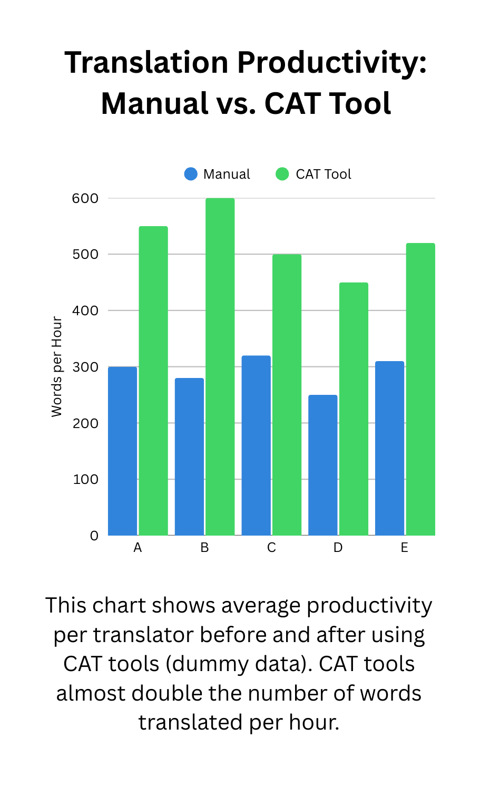

# 🎨 Visual Samples

Here are some of my practice projects as I develop skills in **visual communication for technical writing**.  
The samples include **screenshots**, **diagrams**, and **graphs/infographics** to demonstrate clarity in presenting both step-by-step instructions and complex information.

---

## 📸 Screenshots & Walkthroughs

  
  
<b>Step 1 – Start a new project</b> 
  Go to <b>Project → New…</b> to create a new project.

  
  
<b>Step 2 – OmegaT generates a project folder</b> 
  OmegaT automatically creates a folder with subfolders.

  
  
<b>Step 3 – Confirm and save</b> 
  Click <b>Save</b> to confirm and complete project creation.

---

## 🔄 Diagrams
Here are two exercises where I practiced creating and redesigning diagrams to improve clarity and visual communication.

### 📊 Translation Workflow
A simple flowchart showing the translation process from source text to final delivery.  

---

### 🛠️ Redesign Case Study

**Before – Original OSI Model Diagram**  
The original diagram is busy, colorful, and text-heavy. It contains useful information, but the layout makes it hard to scan quickly.  

**After – Simplified Redesign**  
The redesigned version presents the same information in a clean, consistent layout:  
- Each layer is shown in a stacked box.  
- The PDU and Function are reduced to short, scannable lines.  
- A light gradient color scheme improves readability without overwhelming the user.  

---

## 📊 Graphs & Infographics

Visualizing data helps turn complex information into clear, accessible insights.  

  
  
<b>Translation Productivity: Manual vs. CAT Tool</b> 
  A bar chart created in Canva showing average words translated per hour. 
  CAT tools nearly double productivity compared to manual translation (dummy data).

